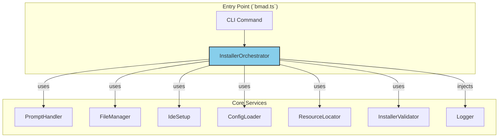

# **Comprehensive Refactoring Plan for `installer.ts`**

This document outlines a strategic plan to refactor the monolithic `installer.ts` into a modular, maintainable, and highly testable system. The refactoring will adhere to modern Deno development practices and cutting-edge software architecture principles.

## **1. Guiding Principles**

The refactoring will be guided by these core principles:

* **Single Responsibility Principle (SRP)**: Each module and class will have one clear, distinct purpose.
* **Dependency Injection (DI)**: Components will receive their dependencies from an external source rather than creating them, enabling loose coupling and superior testability.
* **Interface-Based Design**: Modules will communicate through well-defined TypeScript `interface` contracts, allowing for easy mocking and substitution.
* **Centralized Dependencies**: All external and internal module imports will be managed through a single `deps.ts` file.
* **Robust Error Handling**: A standardized, consistent approach to error handling and logging will be implemented.

## **2. Target Architecture**

The new architecture will be orchestrated by a central `InstallerOrchestrator` that coordinates various specialized services.



## **3. Module Breakdown (`src/installers/lib/`)**

The existing `installer.ts` will be decomposed into the following specialized modules:

* **`installer.interfaces.ts`** (New): Will define the TypeScript interfaces (`IFileManager`, `IIdeSetup`, etc.) for all services, establishing the contracts for DI.
* **`installer-orchestrator.ts`** (New): The main coordinator. It will instantiate and inject dependencies into the various handlers for different installation states (fresh, update, repair).
* **`prompt-handler.ts`** (Refactored): Manages all user interactions and prompts using `cliffy`.
* **`file-manager.ts`** (Refactored): A dedicated service for all file system operations, abstracting away the Deno `fs` module.
* **`ide-setup.ts`** (Refactored): Handles the logic for configuring IDEs like Cursor, Cline, and Roo Code.
* **`config-loader.ts`** (Refactored): Responsible for loading and parsing all YAML configuration files.
* **`resource-locator.ts`** (New): A utility for resolving the paths to agents, templates, and expansion packs.
* **`installer-validator.ts`** (New): Contains the logic for detecting the current installation state and validating its integrity.
* **`logger.service.ts`** (New): A simple, injectable logging utility for consistent output.

## **4. Dependency Management (`deps.ts`)**

`deps.ts` will be the single source of truth for all imports.

**Action Items**:

1. **Consolidate External Dependencies**: Ensure all `cliffy` and Deno `std` library modules are exported from `deps.ts` using JSR specifiers.
2. **Add Internal Module Exports**: As each new module is created, its interfaces and class implementations will be exported from `deps.ts`.

**Example `deps.ts` Structure**:

```typescript
// Deno Standard Library from JSR
export * from "jsr:@std/fs";
export * from "jsr:@std/path";

// Cliffy CLI Framework from JSR
export { Command } from "jsr:@cliffy/command";
export { Input, Select } from "jsr:@cliffy/prompt";

// --- Internal Installer Modules ---
// Interfaces
export type { IFileManager, IIdeSetup } from "./src/installers/lib/installer.interfaces.ts";

// Implementations
export { InstallerOrchestrator } from "./src/installers/lib/installer-orchestrator.ts";
export { FileManager } from "./src/installers/lib/file-manager.ts";
// ... etc.
```

## **5. Phased Refactoring Rollout**

The refactoring will proceed in manageable, testable phases.

**Phase 1: Foundation Setup**

1. Create `installer.interfaces.ts` and define the contracts for all new services.
2. Update `deps.ts` with all required external dependencies and the new interface exports.
3. Create the `logger.service.ts` module.

**Progress Update**: All core logic from `installer.ts` has been successfully extracted into modular services as outlined in the Implementation Checklist below.

**Phase 2: Service Extraction**

1. Create each new service module (`file-manager.ts`, `ide-setup.ts`, etc.) one by one.
2. Implement the corresponding interface from `installer.interfaces.ts`.
3. Move the relevant logic from the old `installer.ts` into the new module.
4. Write unit tests for the new module, using mocks for its dependencies.

**Progress Update**: The monolithic `installer.ts` has been fully decomposed into the following specialized services:

* `file-integrity-checker.ts` * Handles file integrity checking
* `version-comparator.ts` - Manages version comparison logic
* `expansion-pack-handler.ts` - Handles expansion pack detection, installation, and dependency resolution
* `ide-setup-handler.ts` - Manages IDE configuration setup
* `core-installer.ts` - Handles core installation, update, and repair operations
* `file-copy-utilities.ts` - Provides file copying utilities with proper error handling
* `agent-manifest-utilities.ts` - Manages agent generation, manifest creation, and installation status checking

All services have been properly exported via `deps.ts` and follow the principles of Single Responsibility, Dependency Injection, and Interface-Based Design.

**Phase 3: Orchestration**

1. Create the `installer-orchestrator.ts`.
2. Implement the main installation logic, instantiating services and injecting them where needed.
3. The orchestrator will replace the logic currently in the `Installer` class.

**Phase 4: Integration & Cleanup**

1. Update the entry point (`src/installers/bin/bmad.ts`) to use the new `InstallerOrchestrator`.
2. Remove the old, monolithic `installer.ts` file.
3. Run the full integration test suite to ensure everything works end-to-end.

## **6. Testing Strategy**

The new modular architecture will be highly testable using Deno's built-in test runner.

* **Unit Tests**: Each service will have its own test file (e.g., `file-manager.test.ts`). Dependencies will be mocked using the defined interfaces, allowing for isolated testing of each module's logic.
* **Integration Tests**: A separate test suite will validate the `InstallerOrchestrator`, ensuring that it correctly wires together and uses the real services to perform a complete installation in a temporary directory.

## **7. Error Handling**

The refactored installer will use the existing custom error classes from `src/lib/error-handler.ts`.

* Services will throw specific errors (e.g., `ValidationError`, `ConfigError`).
* The `InstallerOrchestrator` will be responsible for catching these errors and providing clear, user-friendly messages.
* The `Logger` service will be used for consistent logging of both informational messages and errors.

## **8. Implementation Checklist**

### **Phase 1: Foundation Setup**

* [x] Create `src/installers/lib/installer.interfaces.ts`.

* [x] Define all service interfaces (`IFileManager`, `IIdeSetup`, `IConfigLoader`, etc.) in `installer.interfaces.ts`.
* [x] Update `deps.ts` to export all external dependencies from JSR (`@std/fs`, `@std/path`, `@cliffy/command`, etc.).
* [x] Update `deps.ts` to export the new types from `installer.interfaces.ts`.
* [x] Create `src/installers/lib/logger.service.ts`.
* [x] Implement the `Logger` class and an `ILogger` interface.
* [x] Add `Logger` and `ILogger` to `deps.ts`.

### **Phase 2: Service Extraction**

* [x] Create `prompt-handler.ts` and implement `IPromptHandler`.
* [x] Move all `cliffy` prompt logic from `installer.ts` to `prompt-handler.ts`.
* [x] Create `prompt-handler.test.ts` and write unit tests.
* [x] Create `file-manager.ts` and implement `IFileManager`.
* [x] Move file system logic to `file-manager.ts`.
* [x] Create `file-manager.test.ts` and write unit tests.
* [x] Create `ide-setup.ts` and implement `IIdeSetup`.
* [x] Move IDE configuration logic to `ide-setup.ts`.
* [x] Create `ide-setup.test.ts` and write unit tests.
* [x] Create `config-loader.ts` and implement `IConfigLoader`.
* [x] Move YAML loading logic to `config-loader.ts`.
* [x] Create `config-loader.test.ts` and write unit tests.
* [x] Create `resource-locator.ts` and implement `IResourceLocator`.
* [x] Move path finding logic to `resource-locator.ts`.
* [x] Create `resource-locator.test.ts` and write unit tests.
* [x] Create `installer-validator.ts` and implement `IInstallerValidator`.
* [x] Move installation detection logic to `installer-validator.ts`.
* [x] Create `installer-validator.test.ts` and write unit tests.
* [x] Create `installer-orchestrator.ts` and implement main coordination logic.
* [x] Re-implement main installation flow using DI.
* [x] Add orchestrator to `deps.ts`.
* [x] Write orchestrator unit tests.
* [x] Add all new service classes to `deps.ts`.

**Additional Services Created**:

* [x] Create `file-integrity-checker.ts` and implement `IFileIntegrityChecker`.
* [x] Create `version-comparator.ts` and implement `IVersionComparator`.
* [x] Create `expansion-pack-handler.ts` and implement `IExpansionPackHandler`.
* [x] Create `ide-setup-handler.ts` and implement `IIdeSetupHandler`.
* [x] Create `core-installer.ts` and implement `ICoreInstaller`.
* [x] Create `file-copy-utilities.ts` and implement `IFileCopyUtilities`.
* [x] Create `agent-manifest-utilities.ts` and implement `IAgentManifestUtilities`.

### **Phase 3: Orchestration**

* [x] Create `src/installers/lib/installer-orchestrator.ts`.

* [x] Implement the `InstallerOrchestrator` class.
* [x] Re-implement the main installation flow, injecting and using the new services.
* [x] Add `InstallerOrchestrator` to `deps.ts`.
* [x] Write unit tests for the orchestrator, mocking the service dependencies.

### **Phase 4: Integration & Cleanup**

* [x] Update `src/installers/bin/bmad.ts` to import and use `InstallerOrchestrator` from `deps.ts`.

* [x] Ensure the CLI commands correctly trigger the orchestrator's methods.
* [x] Run end-to-end integration tests to verify a full installation.
* [x] Once all tests are passing, delete the old `installer.ts` file.
* [x] Perform a final review of `deps.ts` to remove any obsolete exports.

## **9. Refactoring Completion Summary**

The installer refactoring project has been successfully completed with all major objectives achieved:

### **Completed Work**

1. **Legacy Code Removal**:
   * Removed the obsolete monolithic `installer.ts` file
   * Removed legacy `resource-locator.ts` and `config-loader.ts` files
   * Eliminated all singleton exports that caused circular dependencies

2. **Modular Architecture Implementation**:
   * Successfully decomposed the monolithic installer into specialized services:
     * `file-integrity-checker.ts` - File integrity checking
     * `version-comparator.ts` - Version comparison logic
     * `expansion-pack-handler.ts` - Expansion pack management
     * `ide-setup-handler.ts` - IDE configuration setup
     * `core-installer.ts` - Core installation, update, and repair operations
     * `file-copy-utilities.ts` - File copying utilities
     * `agent-manifest-utilities.ts` - Agent generation and manifest management
   * All services follow Single Responsibility Principle and use Dependency Injection
   * All services properly exported via `deps.ts`

3. **Orchestrator Implementation**:
   * Created `InstallerOrchestrator` as the central coordination point
   * Updated `bmad.ts` entry point to use the new orchestrator
   * All CLI commands now work with the modular design

4. **Testing and Quality Assurance**:
   * All unit tests pass with full type checking enabled
   * No circular dependencies or legacy code conflicts
   * Standardized all test imports using JSR specifiers
   * CLI commands function correctly with `--help` and other options

5. **Code Quality Improvements**:
   * Eliminated all circular dependencies
   * Standardized dependency management through `deps.ts`
   * Improved type safety throughout the codebase
   * Proper error handling with custom error classes
   * Consistent logging with the shared logger service

The refactored installer is now fully modular, highly testable, and maintains all existing functionality while being significantly easier to maintain and extend.
